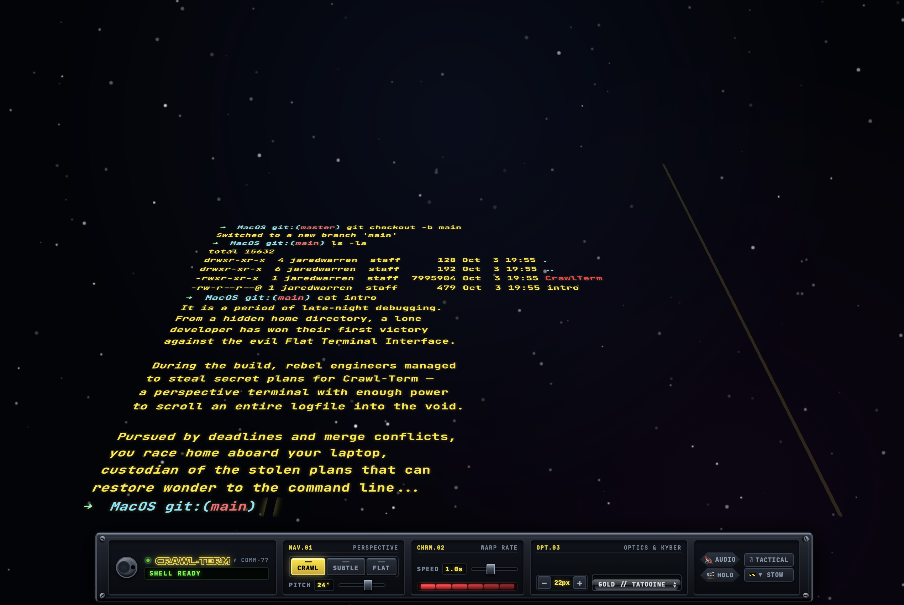

# Crawl-Term

A local terminal emulator that renders your shell output as a receding perspective crawl — as a native macOS app or in the browser.

> Fan project. Not affiliated with, endorsed by, or associated with Lucasfilm Ltd., Disney, or any related trademarks.




## Features

- **Native macOS app** — Cocoa + WKWebView window, custom Dock/app icon, `/Applications` install
- **Opening sequence** — “a long time ago…”, Star Jedi Hollow logo, skippable fanfare intro
- **Perspective projection** — monospace output on an inclined plane into a vanishing point
- **Continuous scroll** — smooth upward glide with adjustable line timing
- **Console HUD** — mode, speed, font scale, kyber themes, tilt, audio, intro replay, fullscreen, stow
- **Single binary** — HTML/CSS/JS embedded via `embed.FS` (live `./static` override for UI work)

## Requirements

- Go 1.25+
- macOS 11+ for the native desktop app (CGO + Cocoa/WebKit)
- Linux works in browser-fallback mode (PTY + system browser)

## Install as a native app (macOS)

```bash
make update          # build CrawlTerm.app and copy to /Applications
open -a CrawlTerm    # launch from Applications / Spotlight / Dock
```

Or build the bundle without installing:

```bash
make app
open ./CrawlTerm.app
```

The app bundle ships the `intro` demo text next to the binary so `cat intro` works from the app’s working directory.

Logs (GUI mode): `~/Library/Logs/CrawlTerm/crawlterm.log`

## Quick start (dev)

```bash
make run      # build and open the native window on http://127.0.0.1:8765
make kill     # stop CrawlTerm and free port 8765
```

Headless / browser-only:

```bash
./crawlterm -open=false
# or
./crawlterm -no-open
```

### Flags

| Flag | Default | Description |
|------|---------|-------------|
| `-port` | `8765` | HTTP / WebSocket port |
| `-shell` | `$SHELL` or `/bin/zsh` | Shell binary |
| `-open` | `true` | Open native desktop window (macOS) |
| `-no-open` | off | Alias for `-open=false` |

### Demo crawl

In the terminal:

```bash
cat intro
```

## HUD controls

- **MODE**: `Crawl (18°)`, `Subtle (8°)`, `Flat (0°)`
- **SPEED**: crawl timing slider
- **FONT**: text scale (`−` / `+`)
- **THEME**: Gold / Tatooine, Sith Crimson, Hoth Ion Blue, Yoda / Dagobah
- **TILT**: angle slider
- **AUDIO**: optional fanfare and keystroke ticks
- **HOLO**: replay the opening sequence
- **TACTICAL**: toggle fullscreen
- **STOW**: collapse the console deck

Skip the intro anytime with **Space** or a click.

## Easter eggs

- `exec 66` or `exec order 66` — confirm with `y` to quit CrawlTerm (Order 66)

More ideas live in [ROADMAP.md](ROADMAP.md).

## Development

```bash
make build    # compile binary (CGO on macOS)
make app      # package CrawlTerm.app
make update   # install/update /Applications/CrawlTerm.app
make run      # build + launch
make kill     # stop processes / free port
make test
make fmt
make vet
make tidy
make clean
```

With `./static` present next to the binary, files are served from disk for live UI edits; otherwise embedded assets are used.

Icon sources used by `make app`:

- `build/CrawlTerm.icns` — macOS app icon
- `build/CrawlTerm.png` / `static/icon.png` — Dock / favicon fallback
- `static/icon.svg` — browser favicon

## Security note

Crawl-Term binds to `127.0.0.1` and spawns your local shell over a WebSocket. Treat it like any local terminal — do not expose the port to untrusted networks.

## License

MIT — see [LICENSE](LICENSE).

Third-party attributions (xterm.js, Star Jedi Hollow, Go deps): [THIRD_PARTY.md](THIRD_PARTY.md).
